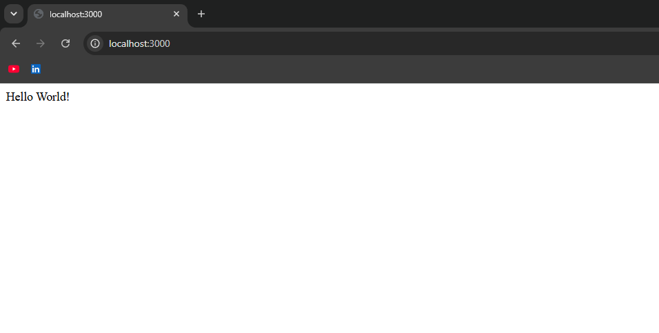
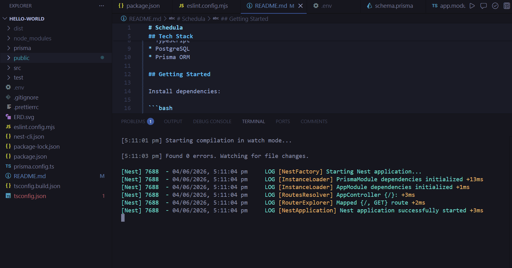

# Schedula

  

Backend project setup using NestJS, TypeScript, PostgreSQL, and Prisma.

  

## Tech Stack

  

* NestJS

* TypeScript

* PostgreSQL

* Prisma ORM

  

## Getting Started

  

Creating Project:

  

```bash

nest new schedula-bhavesh
cd schedula-bhavesh

```

  

Start the development server:

  

```bash

npm run start:dev

```

  

Application will be available at:

  

```text

http://localhost:3000

```

  

## Database Schema

  

The database schema is defined in:

  

```text

prisma/schema.prisma

```

  

Prisma is used as the ORM and schema management tool.

  

## ER Diagram

  

The ERD was generated directly from the Prisma schema using `prisma-erd-generator`.

  

Generate Prisma client and ERD:

  

```bash

npx prisma generate

```

  

Generator configuration:

  

```prisma

generator erd {

  provider = "prisma-erd-generator"

  output   = "../ERD.svg"

}

```

  

## Why is `ERD.svg` committed?

  

The generated ERD is included in the repository so the database design can be reviewed without requiring local setup or regeneration. It serves as a visual representation of the Prisma schema and remains synchronized with schema changes.

  

## Repository Structure

  

```text

.

├── prisma/

│   └── schema.prisma

├── src/

├── ERD.svg

└── README.md

```

### Screenshots 

Localhost working :



Console Logs : 



## Author

  

Bhavesh Kadam